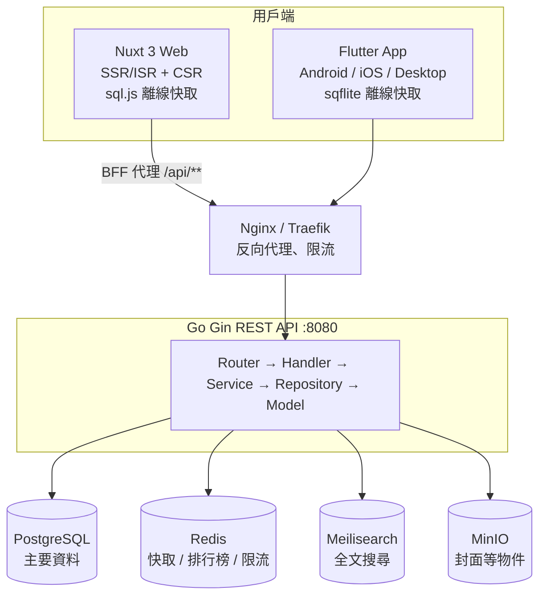

# Palimpsest

> 跨平台中文小說閱讀應用程式：Web、Android、iOS、Desktop 一套後端通吃，支援繁體中文 / 簡體中文 / 英文閱讀、即時翻譯與離線閱讀。

Palimpsest 的定位類似「起點中文網」。讀者可以逛書城、搜尋、排行榜，在自訂的閱讀器裡看書，並在多個裝置之間同步書架與閱讀進度。系統以 OpenCC 做繁簡轉換、以 Google Translate 做英文翻譯，並把章節快取在本地 SQLite，沒有網路也能繼續閱讀。

> [!NOTE]
> 本專案目前處於 **MVP 開發階段（v0.1.0）**。後端 API 骨架、Web 與 Flutter 的主要頁面已經建立，但部分功能仍是佔位實作，詳見[開發進度](#開發進度)。

---

## 目錄

- [功能特色](#功能特色)
- [技術棧](#技術棧)
- [系統架構](#系統架構)
- [專案結構](#專案結構)
- [快速開始](#快速開始)
- [環境變數](#環境變數)
- [API 概覽](#api-概覽)
- [測試與 CI](#測試與-ci)
- [開發進度](#開發進度)
- [設計文件](#設計文件)
- [開發規範](#開發規範)

---

## 功能特色

| 模組 | 說明 |
|------|------|
| 👤 **會員系統** | Email 註冊 / 登入、JWT 驗證（Access 24 小時 + Refresh 30 天）、忘記密碼 |
| 📚 **書城** | 小說列表、分類瀏覽、小說詳情、章節目錄、排行榜（Redis Sorted Set） |
| 🔍 **搜尋** | 以 Meilisearch 做全文搜尋，含搜尋建議與熱門關鍵字 |
| 📖 **閱讀器** | 捲動 / 翻頁模式，可調整字級（12–36）、行距（1.2–3.0），內建白、米黃、護眼綠、深色、純黑五種主題 |
| 🗂️ **書架** | 收藏小說、跨裝置同步閱讀進度 |
| 🌐 **翻譯** | 繁 ⇄ 簡轉換（OpenCC）、中文 → 英文翻譯（Google Translate），結果快取 7 天 |
| 📴 **離線閱讀** | Web 使用 sql.js（WebAssembly SQLite），App 使用 sqflite，兩端共用同一套 Schema |
| 🛠️ **管理後台** | 小說與章節 CRUD、批次匯入章節、用戶管理、書評審核、檢舉處理、統計總覽 |

---

## 技術棧

| 層級 | 技術 |
|------|------|
| **後端** | Go 1.27+、[Gin](https://github.com/gin-gonic/gin)、GORM v2、golang-jwt v5、bcrypt |
| **資料庫 / 中介服務** | PostgreSQL 16、Redis 7、Meilisearch 1.6、MinIO（S3 相容） |
| **Web 前端** | Nuxt 3、Vue 3、TypeScript 5、Pinia、Naive UI、UnoCSS、VueUse、sql.js |
| **Mobile / Desktop** | Flutter 3、Dart 3、Riverpod 2、go_router、Dio 5、sqflite |
| **測試** | `go test`、Vitest + Vue Test Utils、Playwright、`flutter_test` |
| **基礎設施** | Docker Compose（開發）、Kubernetes（正式環境規劃）、GitHub Actions |

---

## 系統架構



### 後端分層

```
Router (Gin + middleware)
  → Handler     請求驗證、回應格式化
  → Service     商業邏輯
  → Repository  資料存取（GORM）、Redis 快取
  → Model       資料結構
```

Middleware 順序：`Recovery → Logger → CORS → Auth（受保護路由）→ AdminOnly（管理路由）`。翻譯路由另外套用以 Redis 為基礎的限流（每分鐘 20 次）。

### Web 渲染策略

| 路由 | 渲染方式 | 原因 |
|------|----------|------|
| `/`、`/category/**`、`/ranking/**` | SSR + ISR（600 秒） | SEO、公開頁面 |
| `/novel/**` | SSR + ISR（300 秒） | SEO、內容更新較頻繁 |
| `/read/**`、`/bookshelf`、`/profile/**`、`/admin/**` | CSR | 私人或高度互動頁面 |

Nuxt 的 `server/api/[...].ts` 是 BFF 層，把 `/api/**` 轉發到 Go 後端。

### 快取策略（Cache-Aside）

Redis Key 格式為 `palimpsest:{entity}:{id}:{field}`。

| 資料 | TTL |
|------|-----|
| 小說詳情 / 排行榜 | 10 分鐘 |
| 章節內容 | 1 小時 |
| 分類 | 24 小時 |
| 翻譯結果 | 7 天 |

---

## 專案結構

```
Palimpsest/
├── backend/                    # Go REST API
│   ├── cmd/server/             # 進入點（main.go、router.go）
│   ├── internal/
│   │   ├── config/             # 環境變數設定
│   │   ├── middleware/         # auth、cors、logger、ratelimit
│   │   ├── handler/            # auth、novel、bookshelf、search、translation、admin
│   │   ├── service/            # 商業邏輯（含 ranking、translation）
│   │   ├── repository/         # user、novel、bookshelf、cache
│   │   ├── model/              # GORM 模型與統一回應格式
│   │   └── pkg/jwt/            # JWT 簽發與驗證
│   ├── migrations/             # PostgreSQL migration SQL
│   └── Dockerfile
├── web/                        # Nuxt 3 Web App
│   ├── pages/                  # 檔案式路由（首頁、小說、分類、排行、閱讀、書架、搜尋、個人、後台）
│   ├── components/             # common/、novel/、reader/
│   ├── composables/            # useAuth、useNovel、useReader、useBookshelf、useTranslation、useLocalDb、useSync
│   ├── stores/                 # Pinia：auth、reader、app
│   ├── layouts/                # default、reader、auth、admin
│   ├── middleware/             # auth、admin 路由守衛
│   ├── plugins/                # naive-ui、sql.js（client-only）
│   ├── server/api/             # BFF 代理
│   ├── tests/unit/             # Vitest 單元測試
│   └── Dockerfile
├── mobile/                     # Flutter App（Clean Architecture）
│   ├── lib/core/               # config、database、network、router、theme
│   ├── lib/features/           # auth、bookstore、reader、bookshelf、search、profile
│   │   └── <feature>/          # data/ → domain/ → presentation/
│   └── test/
├── shared/                     # 跨平台共用定義
│   ├── api-spec/openapi.yaml   # OpenAPI 3.0 規格（API 契約的唯一來源）
│   ├── sqlite-schema/          # Web 與 Flutter 共用的本地 SQLite Schema
│   └── design-tokens/          # 設計 Token（色彩、字型、間距、斷點）
├── docs/                       # 規劃與設計文件
├── .github/workflows/          # backend / web / flutter CI
└── docker-compose.yml          # 本地開發用基礎服務
```

---

## 快速開始

### 前置需求

| 工具 | 版本 |
|------|------|
| Docker / Docker Compose | 最新穩定版 |
| Go | 1.27.1+（見 `backend/go.mod`） |
| Node.js | 22+（pnpm 12 的最低需求） |
| pnpm | 12.4.1（見 `web/package.json` 的 `packageManager`，可用 `corepack enable` 自動切換） |
| Flutter | 3.x（CI 使用 3.47.2） |

### 1. 啟動基礎服務

```bash
docker-compose up -d
```

| 服務 | 位址 | 預設帳密 |
|------|------|----------|
| PostgreSQL | `localhost:5432` | `palimpsest` / `palimpsest`，DB：`palimpsest` |
| Redis | `localhost:6379` | 無密碼 |
| Meilisearch | http://localhost:7700 | 開發模式，無 API Key |
| MinIO API | http://localhost:9000 | `minioadmin` / `minioadmin` |
| MinIO Console | http://localhost:9001 | `minioadmin` / `minioadmin` |

### 2. 啟動後端

```bash
cd backend
go run ./cmd/server
```

預設的環境變數值已經對應 `docker-compose.yml`，本地開發不需額外設定即可啟動。伺服器啟動時會用 GORM `AutoMigrate` 建立核心資料表，另可用 `curl http://localhost:8080/health` 做健康檢查。

> [!TIP]
> `backend/migrations/` 內有完整的 PostgreSQL Schema（22 張表，含 `user_devices`、`reading_history`、`reports`、`translation_cache`、`admin_logs` 等 AutoMigrate 未涵蓋的表）。如需完整結構，可用 [golang-migrate](https://github.com/golang-migrate/migrate) 或 `psql` 手動套用。

Redis 或 MinIO 連線失敗時，伺服器只會印出警告並繼續執行（此時沒有快取或物件儲存）；PostgreSQL 連線失敗則會直接結束。

### 3. 啟動 Web 前端

```bash
cd web
pnpm install
pnpm dev          # http://localhost:3000
```

### 4. 啟動 Flutter App

`mobile/` 目前只包含 Dart 原始碼，尚未提交各平台的原生專案目錄。第一次執行前，請先產生需要的平台：

```bash
cd mobile
flutter create --platforms=android,ios .   # 依需求加入 windows、macos、linux
flutter pub get
flutter run
```

App 預設連到 `http://10.0.2.2:8080/api/v1`（Android 模擬器對應的主機位址）。其他環境請用 `--dart-define` 覆寫：

```bash
flutter run --dart-define=API_BASE_URL=http://localhost:8080/api/v1
```

### 從 OpenAPI 產生型別

```bash
pnpm --dir web generate:api-types      # 產生 web/types/api.d.ts
cd mobile && dart run build_runner build   # 產生 json_serializable 模型
```

---

## 環境變數

### 後端（`backend/internal/config/config.go`）

| 變數 | 預設值 | 說明 |
|------|--------|------|
| `SERVER_PORT` | `8080` | HTTP 監聽埠 |
| `GIN_MODE` | `debug` | `debug` / `release` / `test` |
| `DB_HOST` / `DB_PORT` | `localhost` / `5432` | PostgreSQL 位址 |
| `DB_USER` / `DB_PASSWORD` | `palimpsest` / `palimpsest` | PostgreSQL 帳密 |
| `DB_NAME` / `DB_SSLMODE` | `palimpsest` / `disable` | 資料庫名稱與 SSL 模式 |
| `REDIS_HOST` / `REDIS_PORT` | `localhost` / `6379` | Redis 位址 |
| `REDIS_PASSWORD` | （空） | Redis 密碼 |
| `JWT_SECRET` | `change-me-in-production` | JWT 簽章金鑰，**正式環境務必更換** |
| `MINIO_ENDPOINT` | `localhost:9000` | MinIO 位址 |
| `MINIO_ACCESS_KEY` / `MINIO_SECRET_KEY` | `minioadmin` / `minioadmin` | MinIO 金鑰 |
| `MINIO_BUCKET` | `palimpsest` | Bucket 名稱 |
| `MEILI_HOST` | `http://localhost:7700` | Meilisearch 位址 |
| `MEILI_API_KEY` | （空） | Meilisearch API Key |
| `CORS_ALLOWED_ORIGINS` | `*` | 允許的來源，以逗號分隔，例如 `https://a.com,https://b.com` |

### Web（`web/nuxt.config.ts`）

| 變數 | 預設值 | 說明 |
|------|--------|------|
| `API_BASE_URL` | `http://localhost:8080` | BFF 在伺服器端轉發的 Go 後端位址 |
| `NUXT_PUBLIC_API_BASE_URL` | `/api` | 瀏覽器端呼叫的 API 前綴 |

### Flutter（`--dart-define`）

| 變數 | 預設值 |
|------|--------|
| `API_BASE_URL` | `http://10.0.2.2:8080/api/v1` |

---

## API 概覽

所有 API 都以 `/api/v1` 為前綴，完整規格見 [`shared/api-spec/openapi.yaml`](shared/api-spec/openapi.yaml) 與 [`docs/API_DESIGN.md`](docs/API_DESIGN.md)。

### 回應格式

```jsonc
// 成功
{ "code": 0, "message": "success", "data": { /* ... */ } }

// 分頁
{
  "code": 0,
  "message": "success",
  "data": {
    "items": [ /* ... */ ],
    "pagination": { "page": 1, "page_size": 20, "total": 128, "total_pages": 7 }
  }
}
```

### 錯誤碼

| 範圍 | 類別 |
|------|------|
| `40001–40099` | 參數驗證錯誤 |
| `40101–40199` | 驗證失敗（未登入、Token 失效） |
| `40301–40399` | 權限不足 |
| `40401–40499` | 資源不存在 |
| `40901–40999` | 資源衝突 |
| `42901–42999` | 請求過於頻繁 |
| `50001–50099` | 伺服器錯誤 |

### 端點一覽

| 權限 | 方法與路徑 | 說明 |
|------|-----------|------|
| 公開 | `POST /auth/register`、`/auth/login`、`/auth/refresh`、`/auth/logout` | 註冊、登入、刷新 Token、登出 |
| 公開 | `POST /auth/forgot-password`、`/auth/reset-password` | 忘記密碼、重設密碼 |
| 公開 | `GET /novels`、`/novels/:id` | 小說列表、詳情 |
| 公開 | `GET /novels/:id/chapters`、`/novels/:id/chapters/:chapterId` | 章節目錄、章節內容 |
| 公開 | `GET /categories` | 分類列表 |
| 公開 | `GET /rankings/:type?period=weekly` | 排行榜 |
| 公開 | `GET /search/novels`、`/search/suggestions`、`/search/hot-keywords` | 搜尋 |
| 登入 | `GET` / `POST /bookshelf`、`DELETE /bookshelf/:novelId` | 書架 |
| 登入 | `GET` / `PUT /reading-progress/:novelId` | 閱讀進度 |
| 登入 · 限流 | `POST /translation/convert`、`/translation/chapter`、`/translation/text` | 繁簡轉換、翻譯 |
| 管理員 | `/admin/novels`、`/admin/chapters`、`/admin/novels/:id/chapters/batch` | 小說與章節管理 |
| 管理員 | `/admin/users`、`/admin/reviews`、`/admin/reports`、`/admin/stats` | 用戶、審核、檢舉、統計 |

受保護的端點需帶上 `Authorization: Bearer <access_token>`。

---

## 測試與 CI

### 在本地執行測試

```bash
# 後端
cd backend && go test ./...

# Web
cd web
pnpm test:run      # 單次執行 Vitest
pnpm test          # 監看模式
pnpm test:e2e      # Playwright E2E
pnpm typecheck     # TypeScript 型別檢查
pnpm lint          # ESLint

# Flutter
cd mobile
flutter test
dart analyze
```

### 測試範圍

| 層級 | 框架 | 目前涵蓋 |
|------|------|----------|
| 後端 | `go test` | config、handler、middleware、model、jwt、service |
| Web | Vitest + Vue Test Utils | composables（bookshelf、localDb、novel、sync、translation）、stores（app、auth、reader） |
| Flutter | `flutter_test` | app、config、各功能的 domain entities、reader provider |

### GitHub Actions

三條 Workflow 各自依路徑觸發（push 到 `main` 或對 `main` 發 PR 時）：

| Workflow | 觸發路徑 | 內容 |
|----------|----------|------|
| [`backend.yml`](.github/workflows/backend.yml) | `backend/**` | `go build` + `go test ./internal/...` |
| [`web.yml`](.github/workflows/web.yml) | `web/**`、`shared/**` | Node 20 + pnpm，執行 `pnpm test:run` |
| [`flutter.yml`](.github/workflows/flutter.yml) | `mobile/**`、`shared/**` | Flutter 3.47.2，執行 `flutter test` |

---

## 開發進度

目前處於 Roadmap 的 **Phase 1（MVP）**。

| 項目 | 狀態 | 備註 |
|------|:----:|------|
| 後端分層架構、設定、優雅關機 | ✅ | |
| 會員註冊 / 登入 / JWT / 重設密碼 Token | ✅ | 尚未串接寄信服務 |
| 小說、章節、分類 API（含 Redis 快取） | ✅ | |
| 書架與閱讀進度 API | ✅ | |
| 排行榜 | ✅ | 優先讀 Redis Sorted Set，無資料時退回資料庫查詢 |
| Meilisearch 搜尋與索引 | ✅ | 熱門關鍵字目前回傳空陣列 |
| 管理後台 API | 🚧 | 小說、章節、用戶、統計可用；檢舉相關端點為佔位 |
| 翻譯 API（路由、快取、限流） | 🚧 | **OpenCC 與 Google Translate 尚未整合**，目前原文回傳 |
| 全域 API 限流（公開 60 / 登入 120 次/分） | 📋 | 目前僅翻譯路由有套用限流 |
| Web 主要頁面、Pinia stores、BFF 代理 | ✅ | |
| Web 管理後台頁面 | 🚧 | 統計總覽待實作 |
| Web 離線快取（sql.js）與資料同步 | 🚧 | `useLocalDb`、`useSync` 為骨架 |
| Flutter 登入、書城、閱讀器、書架、搜尋、個人頁 | ✅ | |
| Flutter 原生平台專案目錄 | 📋 | 需先執行 `flutter create` |
| 社群功能（書評、留言、按讚） | 📋 | 資料表已設計，API 待開發 |
| Kubernetes 部署設定 | 📋 | |

✅ 完成　🚧 進行中 / 部分完成　📋 規劃中

### 後續階段

| 階段 | 內容 |
|------|------|
| **Phase 1** | MVP：Web App + Android App |
| **Phase 2** | iOS App、社群功能強化、功能優化 |
| **Phase 3** | Desktop App（Windows / macOS / Linux）與進階功能 |
| **Phase 4** | 商業化功能 |

完整時程見 [`docs/DEVELOPMENT_ROADMAP.md`](docs/DEVELOPMENT_ROADMAP.md)。

---

## 設計文件

| 文件 | 內容 |
|------|------|
| [PROJECT_OVERVIEW.md](docs/PROJECT_OVERVIEW.md) | 專案願景、範圍、目標用戶、KPI、風險評估 |
| [FEATURE_SPEC.md](docs/FEATURE_SPEC.md) | 功能模組、優先級與 P0 詳細規格、非功能性需求 |
| [TECHNICAL_ARCHITECTURE.md](docs/TECHNICAL_ARCHITECTURE.md) | 系統架構、各端技術設計 |
| [API_DESIGN.md](docs/API_DESIGN.md) | REST API 設計規範與端點細節 |
| [DATABASE_DESIGN.md](docs/DATABASE_DESIGN.md) | PostgreSQL、Redis、本地 SQLite 設計 |
| [CROSS_PLATFORM_STRATEGY.md](docs/CROSS_PLATFORM_STRATEGY.md) | 跨平台共用策略（API 規格、Schema、設計 Token） |
| [DEVELOPMENT_ROADMAP.md](docs/DEVELOPMENT_ROADMAP.md) | 開發階段、Sprint 規劃、里程碑 |

---

## 開發規範

- **分支策略**：GitHub Flow（`main` + feature branch），以 Squash Merge 合併，至少需要 1 位 Reviewer 核准
- **Commit 格式**：[Conventional Commits](https://www.conventionalcommits.org/)，例如 `feat:`、`fix:`、`docs:`、`refactor:`、`test:`、`chore:`
- **API 契約**：先修改 `shared/api-spec/openapi.yaml`，再重新產生 Web 與 Flutter 的型別
- **資料庫**：UUID 主鍵、snake_case 欄位、`created_at` / `updated_at` / `deleted_at`，軟刪除搭配 `WHERE deleted_at IS NULL` 部分索引
- **本地 Schema**：`shared/sqlite-schema/migrations/` 同時供 Web（sql.js）與 Flutter（sqflite）使用，修改時須兩端一起驗證
- **設計 Token**：色彩、字型、間距統一定義在 `shared/design-tokens/tokens.json`

使用 AI 程式助理協作時，請參考 [`CLAUDE.md`](CLAUDE.md) 與 [`AGENTS.md`](AGENTS.md)。
